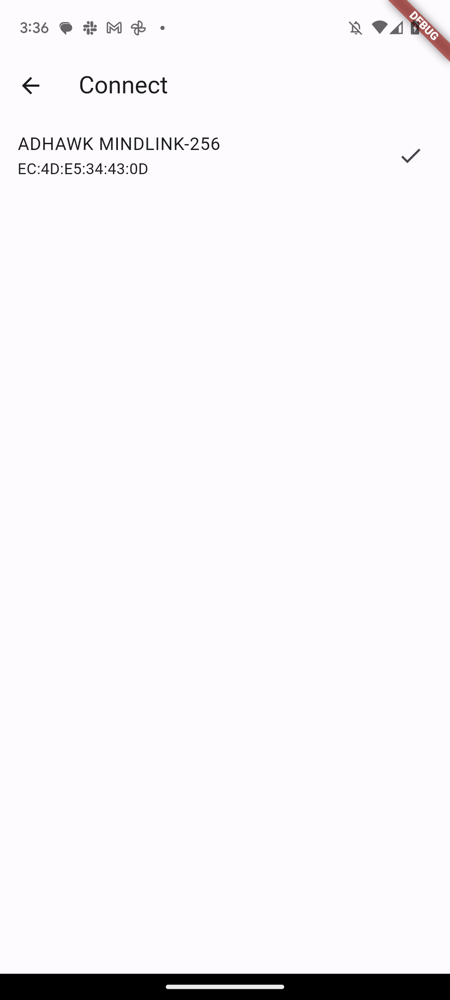
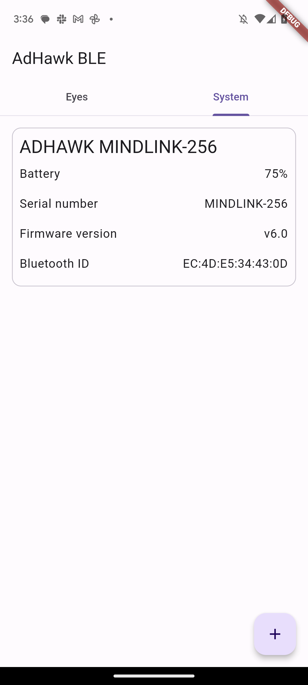
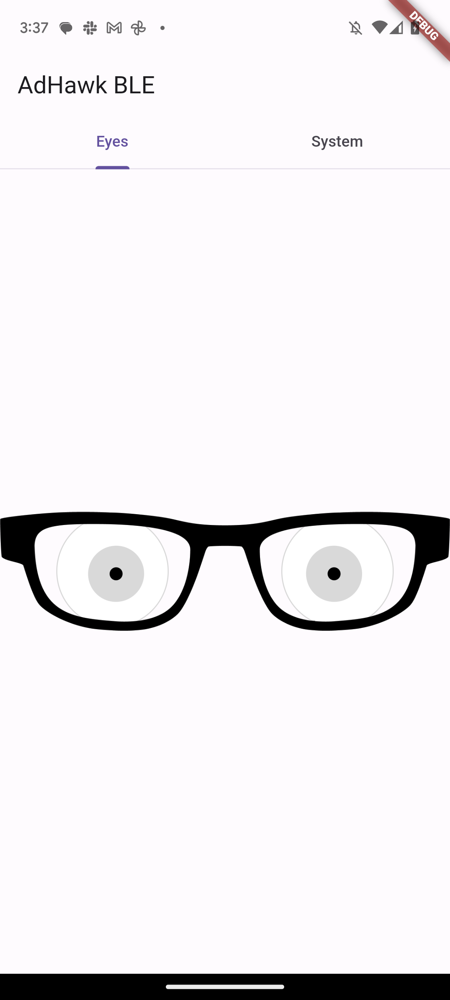

# adhawk_ble_example

The example app provides a starting point for connecting to AdHawk BLE devices and using the eyetracking data. It handles scanning, connecting and setting up communicaton with the glasses.

You can enhance or modify the application to make use of the eye tracking data

| Connect | System | Eyes |
|---------|--------|------|
|  |  |  |

